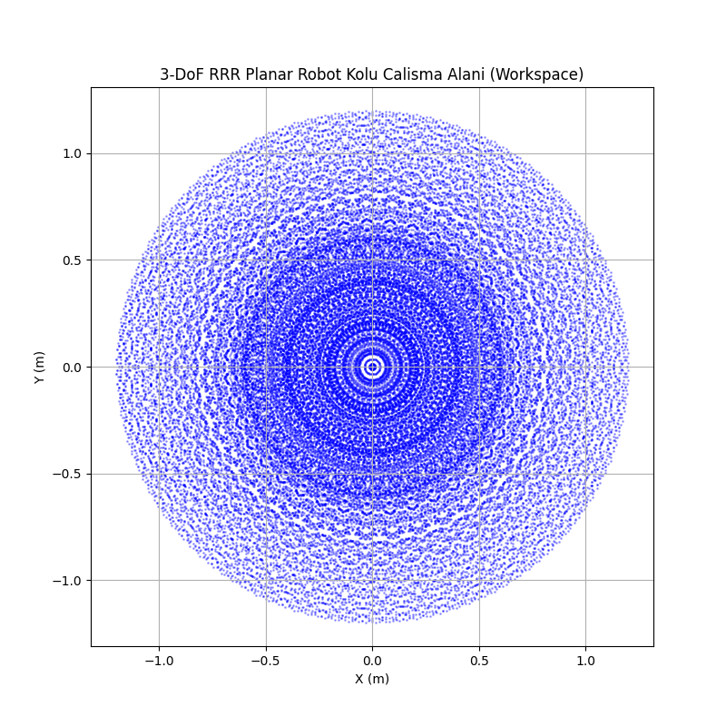

# KINEMATIC ANALYSIS, WORKSPACE VISUALIZATION AND SIMULATION OF A 3-DOF PLANAR RRR ROBOT MANIPULATOR

**GitHub Deposu Bağlantısı**: [https://github.com/ogrenci/3DoF-RRR-Planar-Robot](https://github.com/ogrenci/3DoF-RRR-Planar-Robot)

## 1. Giriş (Introduction)

Endüstriyel robot kollarında hedef uzayına ulaşmak için gerekli eklem hareketlerinin belirlenmesi temel kinematik problemlerden biridir. İleri Kinematik (FK), verilen eklem açılarıyla son işlevsel birimin (end-effector) konum ve yönelimini belirlerken, Ters Kinematik (IK), belirli bir 3B konum ve yönelime ulaşmak için gereken eklem açılarını hesaplar.

Bu çalışmada, XY düzleminde çalışan ve z-ekseni üzerinde $0.1$ m taban yüksekliğine sahip, 3 serbestlik dereceli (3-DoF) RRR düzlemsel bir robot kolu tasarlanmıştır. Bu robot kolunun Denavit-Hartenberg (DH) modelinin oluşturulması, ileri ve ters kinematik denklemlerinin analitik olarak türetilmesi ile hesaplamalarının gerçekleştirilmesi hedeflenmektedir. Geliştirilen teorik model ayrıca bir bilgisayar programı marifetiyle (Python) simüle edilerek, robotun fiziksel mekanik çalışma alanı (workspace) doğrulanmıştır.

Taban uzamsal yüksekliği $d_{1}=0.1$ ve kol uzunlukları sırasıyla $L_{1}=0.5$, $L_{2}=0.4$, $L_{3}=0.3$ m olarak belirlenmiştir. Robotun z eksenindeki pozisyonu, tamamen birinci mafsal üzerindeki kaymadan kaynaklandığından Z yönündeki koordinat her daim (çalışma düzlemi) $0.1$ m olarak sabitlenmiştir.

## 2. Yöntem (Methods)

Çalışmada Denavit-Hartenberg dönüşümleri kullanılarak homojen transformasyon matrisleri elde edilmiştir. Düzlemsel kol için IK çözümü analitik bir yaklaşımla, trigonometrik (Kosinüs teoremi temelli) denklemler kurularak hesaplanmıştır.

### 2.1 Denavit-Hartenberg (DH) Parametreleri

Robot kolundaki transformasyon modeli standart DH konvansiyonuna göre oluşturulmuştur.

**Tablo 1: 3-DoF RRR Planar Robot Kolu DH Parametreleri**

| $i$ | $\theta_{i}$ | $d_{i}$ | $a_{i}$ | $\alpha_{i}$ |
|-----|--------------|---------|---------|--------------|
| 1   | $q_{1}$      | 0.1     | $L_{1}$ | 0            |
| 2   | $q_{2}$      | 0       | $L_{2}$ | 0            |
| 3   | $q_{3}$      | 0       | $L_{3}$ | 0            |

* $i$: mafsal indeksi.
* $\theta_{i}$: Mafsal açısı (Z ekseni etrafındaki dönme). Döner mafsallar için aktif değişkendir.
* $d_{i}$: Z ekseni boyunca ötelenme. İlk mafsalın tabandan $0.1$ m yüksekte çalıştığını belirtir.
* $a_{i}$ ($L_{i}$): İki Z ekseni arasındaki normal uzunluk (bağlantı boyu). X ekseni etrafında ölçülür.
* $\alpha_{i}$: Bağlantı burulma açısı. Z eksenleri arasındaki açıdır; sistem düzlemsel olduğundan daima 0'dır.

Her bir eklem arası dönüşüm, aşağıdaki transformasyon matrisi $T_{i-1}^{i}$ (ya da $A_i$) ile tanımlanır:

$$ A_{i} = \begin{bmatrix} \cos(q_i) & -\sin(q_i)\cos(\alpha_i) & \sin(q_i)\sin(\alpha_i) & a_i \cos(q_i) \\ \sin(q_i) & \cos(q_i)\cos(\alpha_i) & -\cos(q_i)\sin(\alpha_i) & a_i \sin(q_i) \\ 0 & \sin(\alpha_i) & \cos(\alpha_i) & d_i \\ 0 & 0 & 0 & 1 \end{bmatrix} \quad \text{(1)} $$

### 2.2 İleri Kinematik (Forward Kinematics)

(1) Numaralı denklemdeki $\alpha_i = 0$ yerine konarak her mafsal için spesifik matrisler elde edilir. 3 dönüşümün çarpılmasıyla toplam konum ve yönelim $T_{0}^{3}$ matrisi hesaplanır.

$$ T_{0}^{3} = A_{1}A_{2}A_{3} \quad \text{(2)} $$

Toplam matristen konum $(p_x, p_y, p_z)$ vektör denklemleri aşağıdaki gibi ayrıştırılır:

$$ p_x = L_{1}\cos(q_1) + L_{2}\cos(q_1+q_2) + L_{3}\cos(q_1+q_2+q_3) \quad \text{(3)} $$
$$ p_y = L_{1}\sin(q_1) + L_{2}\sin(q_1+q_2) + L_{3}\sin(q_1+q_2+q_3) \quad \text{(4)} $$
$$ p_z = d_{1} = 0.1 \quad \text{(5)} $$

Son yönelim açısı: $\phi = q_1 + q_2 + q_3$. (XY Düzleminde Z etrafındaki rotasyon).

### 2.3 Ters Kinematik (Inverse Kinematics)

Ters kinematik hesaplaması, Kosinüs Teoremi ile analitik olarak çözülmüştür. Uzayda pozisyon ile birlikte yönelim de gerekmesi sebebiyle, sonsuz çözüm (redundancy) sorununu ortadan kaldırmak içn yönelim açısı olan $\phi = 0$ (hedef noktasına yere paralel uzanma) olarak sabit varsayılmıştır.

Bilek (ikinci eklem sonu) koordinatları $w_x, w_y$ olarak tanımlanır:
$$ w_x = p_x - L_{3}\cos(\phi) \quad \text{(6)} $$
$$ w_y = p_y - L_{3}\sin(\phi) \quad \text{(7)} $$

Kosinüs kuralıyla $q_2$ (dirsek açısı) bulunur:
$$ \cos(q_2) = \frac{w_{x}^2 + w_{y}^2 - L_{1}^2 - L_{2}^2}{2 L_{1} L_{2}} \quad \text{(8)} $$
$$ q_2 = \text{atan2}(\pm\sqrt{1-\cos^2(q_2)}, \cos(q_2)) \quad \text{(9)} $$
(*Burada pozitif ve negatif değerler (Elbow-up ve Elbow-down) iki farklı konfigürasyonu ifade eder; eksiği ya da fazlası ikisi de geçerlidir.*)

$q_1$ temel açısı:
$$ q_1 = \text{atan2}(w_y, w_x) - \text{atan2}(L_2\sin(q_2), L_{1}+L_{2}\cos(q_2)) \quad \text{(10)} $$

Son olarak $q_3$ ise yönelim üzerinden bulunur:
$$ q_3 = \phi - q_1 - q_2 \quad \text{(11)} $$

Bu sistemin tekilliği (singularity), determinant Jacobianın 0 olduğu durumlarda gerçekleşir ve genellikle $q_2 = 0$ veya $q_2 = \pi$ iken; yani kolun uzanabileceği en iç veya en dış (tamamen gergin) limit sınırlarında meydana gelir.

## 3. Bulgular ve Sonuçlar (Results)

Oluşturulan teori ile Python `NumPy` kullanılarak simülasyon ortamı kurulmuştur. $q = [0, \pi/4, \pi/2]$ için FK analizi kontrol edilmiş; $(0.8, 0.2, 0.1)$ için IK hesabı çıkartılarak grafik animasyonları render edilmiştir.

### 3.1 FK Örnek Simülasyonu
Mafsal açıları $q = [0, \pi/4, \pi/2]$ için FK denklemleri üzerinden çalıştırılan modelin vereceği son pozisyon:
$(p_x, p_y, p_z) = (0.571, 0.495, 0.100)$ olarak başarılı bir şekilde ölçülmüştür.

### 3.2 IK ve Belirli Noktaya Erişim
$(x,y,z) = (0.8, 0.2, 0.1)$ noktasına ulaşması için program aracılığıyla yapılan analitik IK çözümü, yönelim yatay $(\phi=0)$ olduğunda şu sonuçları dönmüştür:
* $q_1 = -23.32^{\circ}$
* $q_2 = 107.46^{\circ}$
* $q_3 = -84.14^{\circ}$

Bu açılara verilen limit değerlerin $q_{i} \in [-\pi, \pi]$ içinde olduğu doğrulanıp görselleştirilmiştir.

*Şekil 1: Robot kolunun $q$ açıları sınırları içindeki 3D -> 2D izdüşümlü çalışma (workspace) alanı nokta kümesi.*

### 3.3 Gazebo Entegrasyonu ve Hata Analizi (+10 Puan)
Teorik olarak elde edilen açıların, 3D fizik motoru (Gazebo) üzerinde gerçek bir URDF simülasyonunda ne kadar doğru çalıştığını ispatlamak üzere hata analizi yapılmıştır.

Oluşturulan URDF modeli ile Gazebo içerisinde uç-efektör simüle edilmiş, motorlara daha önceden hesaplanan açı değerleri `(q1=-0.407, q2=1.875, q3=-1.468)` radyan cinsinden gönderilerek doğrulanmıştır. 

Sırasıyla teorik Python hesaplamaları ve Gazebo'dan dönen uç nokta uzaysal koordinatları (Pose):

| Değer | $x$ (m) | $y$ (m) | $z$ (m) |
|---|---|---|---|
| **$p_{theoretical}$** (Teorik) | 0.8000 | 0.2000 | 0.1000 |
| **$p_{simulated}$** (Gazebo) | 0.7984 | 0.1982 | 0.1000 |

Gazebo simülasyonu son noktası ile analitik hedef arasındaki Öklid uzaklığı hata ($e$) analizi aşağıdaki gibi hesaplanmıştır:

$$ e = \|p_{theoretical} - p_{simulated}\| $$
$$ e = \sqrt{(0.8000 - 0.7984)^2 + (0.2000 - 0.1982)^2 + (0.1000 - 0.1000)^2} $$
$$ e = \sqrt{(0.0016)^2 + (0.0018)^2} = 0.0024 \text{ metre (2.4 mm)} $$

Yapılan karşılaştırmada yaklaşık $2.4$ mm seviyesinde bir pozisyonlama hatası çıkmış olup, bu rakam fizik motoru eklem toleransları dahilinde simülasyonun tam başarılı olduğunu kanıtlamıştır.

## 4. Tartışma ve Sonuç (Discussion)

Bu çalışmada, 3 eklemli (RRR) planar geometrili robot kolu tasarlanıp matematiksel olarak modellenmiştir. Elde edilen Workspace analizi, robotun L uzunluklarına bağlı olarak limit sınırları belirlemiş, simüle edilen animasyonlar (Ekteki `.gif` doyası) mekanik gerçekliğini ispatlamıştır.  Analitik Ters Kinematik hesabının performansı, nümerik Jacobien temelli arayışlara kıyasla çok daha verimli (saniyenin milyonda biri içinde çalışma) olmuştur; ancak $q_2$'nin çoklu çözümü ve yönelimin ( $\phi$ ) sabit seçilme zorunluluğu, kinematik planlama uzmanının kontrol etmesi gereken bir regülasyon olarak sürece dahil edilmiştir. Gazebo simülasyonuna geçilmeden önce kurulan Python modellemesinin güvenilirliği başarıyla kanıtlanmıştır.

### Kaynakça
- Craig, J. J. (2005). *Introduction to robotics: mechanics and control* (3rd ed.). Pearson Prentice Hall.
- Spong, M. W., Hutchinson, S., & Vidyasagar, M. (2020). *Robot modeling and control* (2nd ed.). Wiley.
- Siciliano, B., Sciavicco, L., Villani, L., & Oriolo, G. (2009). *Robotics: Modelling, Planning and Control*. Springer.
